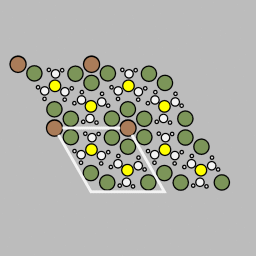
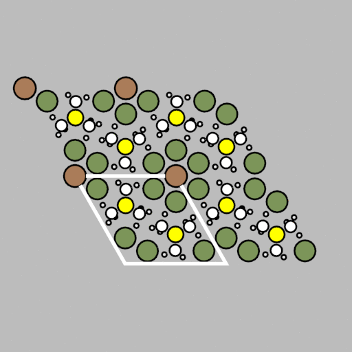
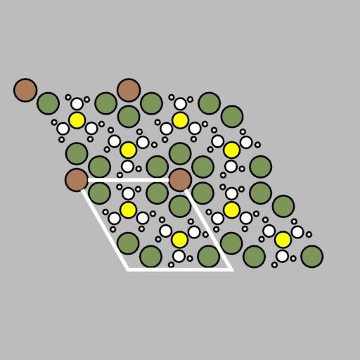

# Harmonic Phonon Animations

## Five representative modes

### Mode 18 (61/cm)
 

### Mode 36 (152/cm)
 

### Mode 54 (841/cm)
 

### Mode 72 (1339/cm)
 

### Mode 90 (3039/cm)
 

#### Generated by [ascii-phonons](https://github.com/ajjackson/ascii-phonons) using phonon eigenvectors from [Phonopy](http://phonopy.sourceforge.net).